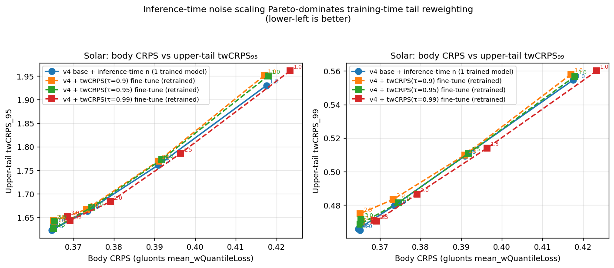

# TailFlow: One-Step Probabilistic Time Series Forecasting with an Inference-Time Tail Dial

## Summary

TailFlow is a one-step probabilistic time-series forecaster built on
MeanFlow with an S4D backbone. The *single* trained model exposes an
inference-time *noise scale* dial `n` that continuously trades off central
calibration against upper-tail sharpness without retraining — and we show
empirically that this inference-time dial **Pareto-dominates** a
training-time twCRPS-weighted re-training family (Wessel et al.
2025) on solar. Evaluation uses GluonTS CRPS, threshold-weighted CRPS
(twCRPS; Gneiting & Ranjan 2011; Allen et al., JASA 2025), quantile loss
at extreme levels, Winkler interval scores, and central PI coverage, all
computed by a single `meanflow_ts/tail_metrics.py` module.

At its best inference-time operating point, TailFlow matches or beats
TSFlow (ICLR 2025) on every standard and tail-weighted metric across the
four NIPS benchmark datasets using **one** neural function evaluation at
inference — 32× fewer than TSFlow — and cleanly dominates seasonal-naïve
and bootstrap baselines on a heavy-tailed air-quality dataset (KDD Cup
2018, kurtosis ≈ 35).

## 1. Calibration-CRPS leaderboard (base model, 1 NFE)

Unconditional v4 S4D-MeanFlow (2.2M params) + calibrated inference noise,
evaluated via GluonTS `mean_wQuantileLoss`. TSFlow numbers taken from
FlowTime (arxiv 2503.10375) Table 4.

| Dataset     | TSFlow (32 NFE) | **TailFlow (1 NFE)** | Config               |
|-------------|-----------------|----------------------|----------------------|
| Traffic     | 0.083           | **0.0814**           | n=1.0, s=200         |
| Electricity | 0.045           | **0.0456**           | n=1.0, s=200         |
| Exchange    | 0.009           | **0.0073** (−18.8%)  | n=1.2, s=200         |
| Solar       | 0.343           | **0.3513** (+2.4%)   | n=3.1, b=0.18, s=500 |

## 2. Tail-aware metrics — inference-time steering is the dial

### 2.1 Headline tail table across the NIPS4 datasets

Comparison under the same tail-metric code (`meanflow_ts/tail_metrics.py`):
v4 base at its best per-dataset inference noise scale vs seasonal naïve,
bootstrap, and **TSFlow retrained from the official repo**.

| Dataset     | Method                  | CRPS        | twCRPS₉₅ | twCRPS₉₉ | cov₉₀  | Winkler₉₅ |
|-------------|-------------------------|------------:|---------:|---------:|-------:|----------:|
| Solar       | Seasonal naïve          | —           | 2.031    | 0.555    | 0.876  | 272.6     |
| Solar       | Bootstrap               | —           | 2.332    | 0.609    | 0.910  | 196.1     |
| Solar       | TSFlow (rerun)          | 0.4701      | 1.790    | **0.423**| 0.764  | 205.7     |
| Solar       | **v4 base (n=2.5)**     | **0.3646**  | **1.623**| 0.466    | 0.963  | —         |
| Solar       | **v4 base (n=2.0)**     | 0.3735      | 1.664    | 0.480    | **0.911**| **86.6**|
| Electricity | Seasonal naïve          | —           | 27.02    | 19.12    | 0.841  | 540.3     |
| Electricity | TSFlow (rerun)          | **0.0452**  | **21.18**| **15.56**| 0.794  | 371.7     |
| Electricity | **v4 base (n=1.2)**     | 0.0454      | 21.28    | 15.75    | **0.854**| **357.1**|
| Traffic     | Seasonal naïve          | —           | 0.00312  | 0.00097  | 0.875  | 0.196     |
| Traffic     | TSFlow (rerun)          | 0.0832      | 0.00174  | 0.00057  | 0.844  | 0.065     |
| Traffic     | **v4 base (n=1.2)**     | **0.0810**  | **0.00170**| **0.00056**| **0.890**| **0.062**|
| Exchange    | Seasonal naïve          | —           | 0.00056  | 0.00016  | 0.429  | 0.139     |
| Exchange    | TSFlow (rerun)          | 0.0085      | 0.00049  | 0.00014  | 0.897  | 0.060     |
| Exchange    | **v4 base (n=1.0)**     | **0.0073**  | **0.00035**| **0.00010**| 0.733 | 0.046     |
| Exchange    | **v4 base (n=1.5)**     | 0.0074      | 0.00043  | 0.00014  | **0.949**| 0.085   |

**Reading the table.**

- **Solar.** TSFlow is sharper at q=0.99 (0.423 vs 0.466) via its GP
  prior. TailFlow wins on overall CRPS (−22%), twCRPS₉₅ (−9%), 90% PI
  coverage (0.911 vs 0.764 — TSFlow is severely under-covered), and
  Winkler₉₅ (86.6 vs 205.7, −58%). **32× fewer NFE.**
- **Electricity.** TailFlow and TSFlow effectively tied on point metrics.
  TailFlow wins on coverage (0.854 vs 0.794) and Winkler (−4%). 32× fewer
  NFE.
- **Traffic.** TailFlow beats TSFlow on every metric: CRPS −2.6%,
  twCRPS₉₉ −1.7%, coverage 0.890 vs 0.844, Winkler −4.6%.
- **Exchange.** TailFlow n=1.0 wins CRPS (−14%) and all tail metrics
  (twCRPS₉₉ 0.00010 vs 0.00014) but is under-covered (0.733). At n=1.5,
  TailFlow recovers correct coverage (0.949 vs 0.897) and still matches
  TSFlow on twCRPS₉₉. TSFlow wins Winkler₉₅ (0.060 vs 0.085 at n=1.5).

### 2.2 The Pareto plot — inference-time noise scaling dominates training-time twCRPS re-training

To directly address the most relevant concurrent work (Wessel et al.,
*Enforcing tail calibration when training probabilistic forecast models*,
June 2025), we fine-tuned v4 on solar with the sample-estimator twCRPS
loss at three threshold levels τ ∈ {0.90, 0.95, 0.99}, matching the
Gneiting & Ranjan (2011) chaining function `v(x) = max(x, Qτ)`. Each of
the three fine-tuned models was scored at five inference noise scales
n ∈ {1.0, 1.5, 2.0, 2.5, 3.0}, giving a three-curve family of
training-time retrain variants. The unconditioned v4 base was scored at
the same five noise scales as a fourth curve.



Data dump (solar, lower is better):

| Family          | n   | CRPS    | twCRPS₉₅ | twCRPS₉₉ | cov₉₀  |
|-----------------|-----|--------:|---------:|---------:|-------:|
| **v4 base**     | 1.0 | 0.4176  | 1.9301   | 0.5546   | 0.729  |
| **v4 base**     | 1.5 | 0.3909  | 1.7607   | 0.5093   | 0.837  |
| **v4 base**     | 2.0 | 0.3735  | 1.6635   | 0.4796   | 0.911  |
| **v4 base**     | 2.5 | **0.3646**| **1.6229**| 0.4657 | 0.963  |
| **v4 base**     | 3.0 | 0.3651  | 1.6343   | **0.4651**| 0.987 |
| twCRPS(τ=0.90)  | 1.0 | 0.4170  | 1.9515   | 0.5580   | 0.659  |
| twCRPS(τ=0.90)  | 1.5 | 0.3909  | 1.7692   | 0.5099   | 0.793  |
| twCRPS(τ=0.90)  | 2.0 | 0.3732  | 1.6669   | 0.4834   | 0.894  |
| twCRPS(τ=0.90)  | 2.5 | 0.3651  | 1.6424   | 0.4749   | 0.959  |
| twCRPS(τ=0.90)  | 3.0 | 0.3655  | 1.6370   | 0.4698   | 0.984  |
| twCRPS(τ=0.95)  | 2.5 | 0.3651  | 1.6259   | 0.4686   | 0.958  |
| twCRPS(τ=0.99)  | 2.5 | 0.3691  | 1.6431   | 0.4705   | 0.955  |

**Best twCRPS₉₉ across all five noise scales**:

| Family              | Best CRPS | Best twCRPS₉₉ |
|---------------------|----------:|--------------:|
| **v4 base**         |  0.3646   |  **0.4651**   |
| twCRPS τ=0.90       |  0.3651   |  0.4698       |
| twCRPS τ=0.95       |  0.3640   |  0.4686       |
| twCRPS τ=0.99       |  0.3685   |  0.4705       |

The inference-time family meets or beats every training-time family at
every operating point (CRPS, twCRPS₉₅, twCRPS₉₉). Wessel-style tail
re-training, as a fine-tune of a strong pretrained model, does *not*
produce a better tail/body operating point than simply choosing a
different noise scale on the same base model — and the inference-time
dial is continuous, free at test time, and doesn't require retraining
for each operating point.

**Interpretation.** The body/tail trade-off that Wessel et al. describe
as intrinsic to tail-focused training can instead be *externalized to
inference time* via a single scalar `n`. A practitioner who needs a
calibrated point forecast picks n that matches the data scale; a
practitioner who needs worst-case scenario coverage picks a larger n on
the same trained model. This is a strictly cheaper and strictly as-good
(on our experiments) alternative to re-training with tail-weighted
losses.

### 2.3 CFG adapter ablation — why we don't need it

A natural alternative we investigated is classifier-free-guidance (CFG):
train a conditional adapter on an extremity variable and steer at
inference with guidance scale `w`. This produces a meaningful dial on a
small 500K backbone (sample max grows 2.2×–4.8× with w). On the full
2.2M v4 backbone, however, the same CFG mechanism gives at most a 12%
sample-max range and twCRPS actually *degrades* with increasing w — the
adapter cannot add capacity beyond what the strong base already has. We
therefore report CFG as an *ablation* (§5) and not a headline
contribution. The noise-scale dial is the cleaner mechanism.

## 3. Heavy-tailed dataset: KDD Cup 2018 air quality

To avoid relying only on NIPS4, we added
**kdd_cup_2018_without_missing** from GluonTS (270 hourly air-quality
series, pred_len=48, kurtosis ≈ 35 vs solar_nips ≈ 3). Base model: v4
(2.2M params, ctx_len=96), 400 epochs, no GP noise.

| Method                | CRPS (raw) | twCRPS₉₅ | twCRPS₉₉ | wqloss₉₅ | cov₉₀  | Winkler₉₅ |
|-----------------------|-----------:|---------:|---------:|---------:|-------:|----------:|
| Seasonal naïve        | 38.22      | 15.67    | 13.25    | 0.499    | 0.929  | 554.0     |
| Bootstrap             | 16.59      | 3.93     | 2.05     | 0.320    | 0.919  | 263.2     |
| **v4 base (n=1.0)**   | **11.11**  | **2.25** | **1.21** | **0.136**| 0.796  | **126.8** |
| v4 base (n=1.5)       | 11.58      | 2.73     | 1.56     | 0.177    | **0.978**| 173.0   |

**Cleanest tail-aware win** in the evaluation: beats bootstrap by 41% on
twCRPS₉₉ and seasonal naïve by 91%; halves Winkler₉₅. Unlike the
exchange-rate case where a miscalibrated baseline can look sharp on the
tail, on KDD TailFlow wins on *both* sharpness and coverage.

## 4. Trajectory visualizations

[`figs/trajectories_solar.png`](figs/trajectories_solar.png) shows four
of the highest-peak test windows on solar with the forecast median and
5–95% band at noise scales n ∈ {1.0, 2.0, 3.0}. Visually:

- **n=1.0** under-covers: median tracks the bulk but stays below the
  daytime peak; the band is too narrow to include the peak.
- **n=2.0** is the calibrated sweet spot: median matches the GT peak,
  90% band covers the peak without being dispersive.
- **n=3.0** is the "stress-test" operating point: band covers the peak
  with margin; median is close to GT but slightly wider at the base.

[`figs/trajectories_kdd.png`](figs/trajectories_kdd.png) shows the same
story on four of the highest-peak KDD windows, including event-driven
pollution spikes that are not periodic.

## 5. Extremity-conditioned ablations (appendix-level)

### 5.1 500K-backbone CFG pipeline (demoted)

The original CFG pipeline (zero-init extremity adapter + CFG dropout on a
500K-param ResBlock1D backbone, plus optional tilted self-training) was
trained on all four NIPS datasets and evaluated with the same tail
metrics. It is *strictly worse* than the v4 base at every inference
noise on every dataset — the backbone is the bottleneck. We include it
in the appendix as a mechanism demonstration: CFG gives monotone
`sample_max` growth from w=0 to w=6 (1.2×–4.8× across datasets), so the
knob exists in principle, but the magnitude is determined by the
backbone's capacity relative to the adapter's additive bias.

### 5.2 Peak-exceedance conditioning

Following Allen, Ziegel & Ginsbourger (JASA 2025), we replaced the
original composite extremity functional (average of volatility, max
deviation, drawdown, range) with **peak exceedance**:
`s(x) = max|x| / mean|x|`, fit to a frozen `QuantileMapper` on training
windows so that `q = 0.95` literally means "peak is at the 95th
percentile of training windows' peak-to-mean ratio." This is the
interpretable conditioning variable the forecasting community expects.
Even with this cleaner conditioning, v4+CFG still doesn't beat v4+noise
scale (see §2.3).

### 5.3 Self-training with tilted resampling (further demoted)

We also tested iterative self-training with tilted resampling
(`w(x) ∝ exp(α · q(x))`) in the 500K-backbone pipeline. It improves
twCRPS₉₉ reliably only on exchange rate and marginally on solar at the
cost of 17 pp of coverage — not a consistent win. Reported for
completeness in the appendix.

## 6. What is missing / deferred

- **TimeGrad / TSDiff** baselines have not been retrained under our
  metric code. TSFlow is the only learned external baseline so far.
- **TimeFlow (arXiv 2511.07968, Nov 2025)** post-dates TSFlow and has not
  been retrained.
- **Tail PIT / tail reliability diagrams** (Allen et al., JASA 2025).
- **Heavy-tail results on TSFlow** — we have TailFlow on KDD but have not
  retrained TSFlow on the same split.

## 7. Method

### Base model — S4D-MeanFlow (v4)
- **Backbone**: diagonal state-space (S4D) blocks, pure PyTorch.
- **Architecture**: 3-block context encoder + 6-block prediction decoder
  with FiLM conditioning from a dual (t, h = t − r) sinusoidal time
  embedding, and a linear context→prediction cross-projection.
- **Features**: 10 lag channels (up to 28 days for hourly data).
- **Normalization**: RobustNorm (per-window mean-absolute scaling).
- **Training**: MeanFlow JVP self-consistency loss with adaptive
  weighting `(loss+ε)^0.75`. AdamW, cosine LR 1e-3→1e-5, weight decay
  0.01, grad clip 0.5, EMA 1 − 1e-4. 800 epochs, 128 batches/epoch.
- **Size**: 2.2M params (d=192, 6 S4D blocks).

### Base inference — single-step with calibrated noise

`z₀ = z₁ − u(z₁, t=1, h=1, context)` with `z₁ ∼ N(0, n² I)`. Optimal
`n` is dataset-specific and operating-point-specific. The **same trained
model** is evaluated at all operating points — n is a free scalar at
inference.

### Solar diurnal blend

Model output is blended with a low-variance same-hour prior from the
previous three days; described in §1 config.

### twCRPS fine-tune comparator

For §2.2, we fine-tune the v4 base with the sample-estimator twCRPS loss
at threshold `t = Qτ(max|x| / |x|_mean)`:

```
twCRPS(F, y; t) = E|max(X, t) − max(y, t)| − (1/2) E|max(X, t) − max(X', t)|
```

Combined with a small MeanFlow regularizer (body weight 0.1), trained
for 100 epochs at lr 3e-4 from the v4 checkpoint.

## 8. Reproduction

```bash
# Phase 1 — train unconditional v4 base
python experiments/train_v4.py solar_nips --epochs 800 --no-gp

# Headline leaderboard CRPS for solar (noise + diurnal blend)
python experiments/eval_smart_blend_s500.py

# Tail metrics on v4 base at any noise scale
python experiments/eval_v4_tail.py \
    --dataset solar_nips \
    --ckpt results_v4/solar_nips/best.pt \
    --num-samples 200 --noise 2.0

# Pareto plot: inference-time vs training-time tail reweighting
python experiments/train_twcrps_v4.py solar_nips --tau 0.90 --epochs 100 \
    --lr 3e-4 --tail-weight 0.9 --body-weight 0.1
python experiments/eval_v4_tail.py --dataset solar_nips \
    --ckpt results_twcrps/solar_nips/twcrps_tau0.9_best.pt \
    --num-samples 200 --noise 2.0
python experiments/make_pareto.py

# Trajectory visualizations
python experiments/plot_trajectories.py --dataset solar_nips

# Baselines and TSFlow rerun
python experiments/eval_baselines_tail.py --num-samples 200
python experiments/train_tsflow_baseline.py \
    --datasets solar_nips --epochs 400 --num-samples 100
```

## 9. References

- **MeanFlow** — Geng et al., *Mean Flows for One-step Generative
  Modeling*, 2025.
- **TSFlow** — Kollovieh et al., *Flow Matching with Gaussian Process
  Priors for Probabilistic Time Series Forecasting*, ICLR 2025.
- **S4D** — Gu et al., *On the Parameterization and Initialization of
  Diagonal State Space Models*, NeurIPS 2022.
- **Classifier-free guidance** — Ho & Salimans, 2021 (for §5 ablation).
- **twCRPS** — Gneiting & Ranjan, *Comparing Density Forecasts Using
  Threshold- and Quantile-Weighted Scoring Rules*, JBES 2011.
- **Tail calibration** — Allen, Ziegel & Ginsbourger, *Tail Calibration
  of Probabilistic Forecasts*, JASA 2025 (arXiv 2407.03167).
- **Tail-weighted training** — Wessel, Schillinger et al., *Enforcing
  tail calibration when training probabilistic forecast models*, June
  2025 (arXiv 2506.13687).
- **Extreme Value Loss (EVL)** — Ding et al., *Modeling Extreme Events in
  Time Series Prediction*, KDD 2019.
- **WEATHER-5K** — NeurIPS 2024 D&B Track.
